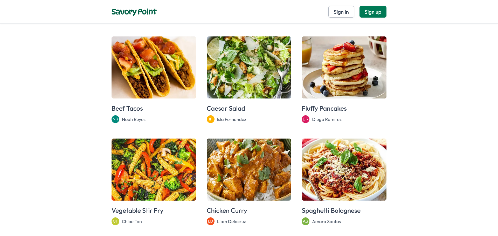

# Savory Point - Recipe sharing platform

## Description

Savory Point is a recipe sharing platform where food enthusiasts can discover, create, and share their favorite recipes with the community. Whether you're a professional chef or a home cook, Savory Point provides the perfect space to showcase your culinary creations.

## Features

### Recipe Management

- Upload new recipes
- Read and browse all uploaded recipes
- Update existing recipe
- Delete recipe you no longer want to share
- Like recipe
- Save recipe

### User Profile

- Update profile
- Change profile photo
- Update account password
- Delete account

### Authentication

- Login
- Signup
- Forgot password flow with email reset
- Protected routes

## Tech Stack

- **Framework**: Next.js (React.js framework)
- **Styling**: TailwindCSS (utility-first CSS framework)
- **Database**: PostgreSQL
- **ORM**: Prisma (ORM)
- **Authentication**: Better Auth
